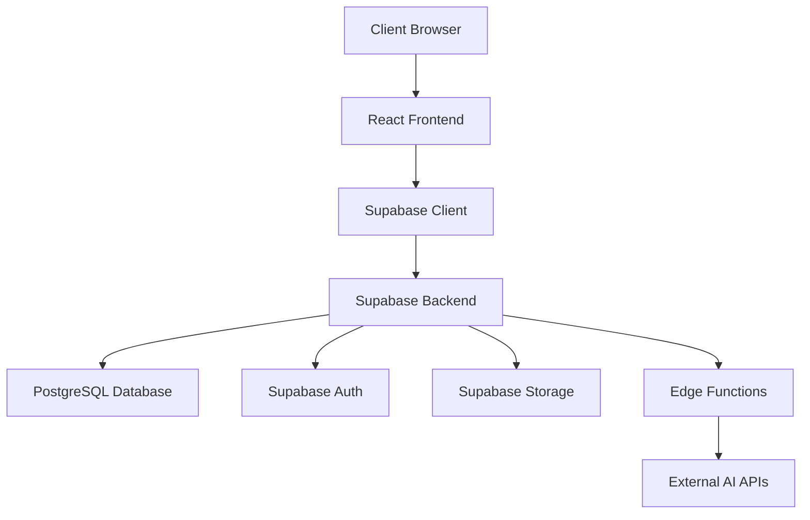
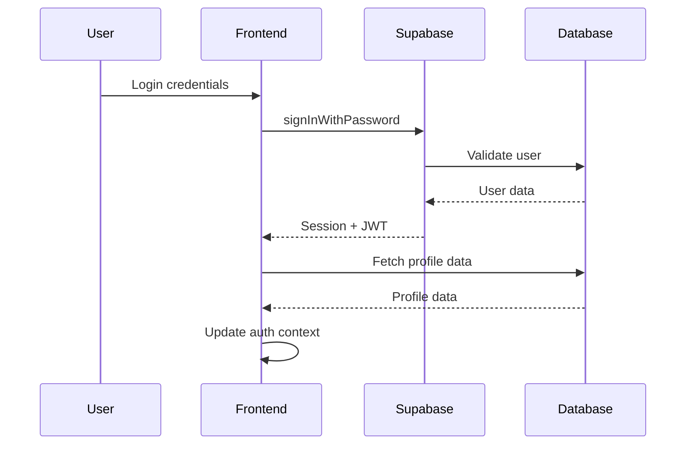
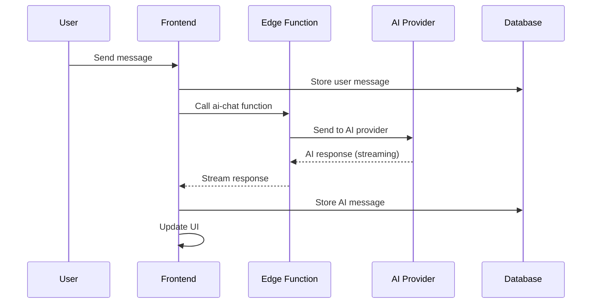

# Zyria Platform - System Architecture

## High-Level Architecture



## Frontend Architecture

### Component Hierarchy
```
App (Root)
├── AuthProvider (Authentication Context)
├── ThemeProvider (Theme Context)
├── QueryClientProvider (React Query)
├── BrowserRouter (Routing)
└── Routes
    ├── Public Routes (HomePage, AuthPage, etc.)
    └── Protected Routes
        └── AppLayout (Sidebar + Content)
            └── Page Components
```

### State Management Strategy
- **Global State**: React Context for auth and theme
- **Server State**: React Query for API data caching
- **Local State**: React useState/useReducer for component state
- **Form State**: React Hook Form for complex forms

### Design System
- **CSS Framework**: Tailwind CSS
- **Component Library**: Custom shadcn/ui components
- **Theme System**: CSS custom properties with dark/light modes
- **Typography**: Inter, Manrope, Lexend font families
- **Color Palette**: HSL-based semantic color tokens

## Backend Architecture (Supabase)

### Database Design
```sql
-- Core user management
profiles (id, user_id, display_name, avatar_url, created_at, updated_at)
tenants (id, name, slug, plan, settings, created_at, updated_at)
tenant_members (tenant_id, user_id, role, created_at)

-- Chat system
conversations (id, tenant_id, user_id, title, created_at, updated_at)
messages (id, conversation_id, sender_id, content, type, created_at)

-- Knowledge base
documents (id, tenant_id, name, content, metadata, status, created_at)
document_chunks (id, document_id, content, embedding, metadata)

-- User management
user_invitations (id, tenant_id, email, role, token, status, expires_at)

-- Analytics
analytics_events (id, tenant_id, user_id, event_type, properties, created_at)
```

### Security Model (RLS Policies)
- **Tenant Isolation**: All data scoped by tenant_id
- **User Access**: Users can only access their tenant's data
- **Role-Based**: Admin/user permissions enforced
- **Authentication**: Supabase Auth with custom profiles

### Edge Functions
1. `ai-chat`: Main AI conversation endpoint
2. `ai-chat-test`: AI provider testing
3. `ai-provider-health-check`: Monitor AI service health
4. `ai-providers-daily-check`: Scheduled health checks
5. `send-invitation`: User invitation emails
6. `send-password-reset`: Password reset emails

## Data Flow Patterns

### Authentication Flow


### Chat Message Flow


## File Organization

### Component Structure
```
components/
├── ui/                  # Base reusable components
├── auth/               # Authentication specific
├── chat/               # Chat interface components
├── dashboard/          # Dashboard widgets
├── knowledge/          # Knowledge base UI
├── layout/            # Layout components
├── tenant/            # Multi-tenant setup
└── theme/             # Theme management
```

### Service Layer
```
services/
├── apiService.ts       # Main API client
├── analyticsService.ts # Analytics tracking
├── conversationService.ts # Chat operations
└── documentService.ts  # Knowledge base operations
```

### Type Definitions
```
types/
└── api.ts             # Comprehensive API types
```

## Routing Architecture

### Route Structure
- **Public Routes**: No authentication required
  - `/` - Homepage
  - `/auth` - Login/register
  - `/about`, `/contact`, `/privacy` - Static pages
  
- **Protected Routes**: Authentication required
  - `/dashboard` - Main dashboard
  - `/chat/*` - Chat interface
  - `/knowledge` - Knowledge base
  - `/settings` - User settings
  - `/admin/*` - Admin panel (role-based)

### Route Protection
- `ProtectedRoute` component wraps authenticated routes
- Automatic redirect to `/auth` for unauthenticated users
- Role-based access control for admin routes

## Integration Patterns

### External API Integration
- **AI Providers**: OpenAI, Anthropic, etc. via Edge Functions
- **Email Service**: Supabase functions for transactional emails
- **File Storage**: Direct Supabase storage integration

### Error Handling Strategy
- **Global Error Boundary**: Catches unhandled React errors
- **API Error Handling**: Centralized in apiService
- **User Feedback**: Toast notifications for user actions
- **Logging**: Console logging (production logging TBD)

## Performance Optimizations

### Frontend Optimizations
- **Code Splitting**: Route-based lazy loading
- **Component Optimization**: React.memo for expensive components
- **Bundle Analysis**: Vite bundle analyzer
- **Asset Optimization**: Image optimization needed

### Backend Optimizations
- **Database Indexing**: Optimized queries with proper indexes
- **Connection Pooling**: Supabase handles connection management
- **Edge Functions**: Deployed globally for low latency
- **Caching**: React Query for client-side caching

## Deployment Architecture

### Build Process
1. TypeScript compilation
2. Vite bundle optimization
3. Static asset generation
4. Environment variable injection

### Hosting Strategy
- **Frontend**: Static hosting (Vercel recommended)
- **Backend**: Supabase managed infrastructure
- **CDN**: Automatic via hosting provider
- **SSL**: Automatic HTTPS

## Monitoring & Observability

### Current Monitoring
- **Supabase Dashboard**: Database and API metrics
- **Browser DevTools**: Frontend debugging
- **Edge Function Logs**: Server-side logging

### Recommended Additions
- **Error Tracking**: Sentry or similar
- **Performance Monitoring**: Web Vitals tracking
- **User Analytics**: Privacy-compliant user behavior tracking
- **Uptime Monitoring**: Service availability tracking

## Security Considerations

### Current Security Measures
- **Authentication**: Supabase Auth with JWT
- **Authorization**: RLS policies for data access
- **Data Validation**: Client-side validation (server-side needed)
- **HTTPS**: Enforced in production

### Security Gaps
- **Input Sanitization**: Comprehensive validation needed
- **Rate Limiting**: Not implemented
- **CSRF Protection**: Additional protection needed
- **Content Security Policy**: Headers configuration needed

---
*Architecture documentation - Last updated: 2025-01-21*